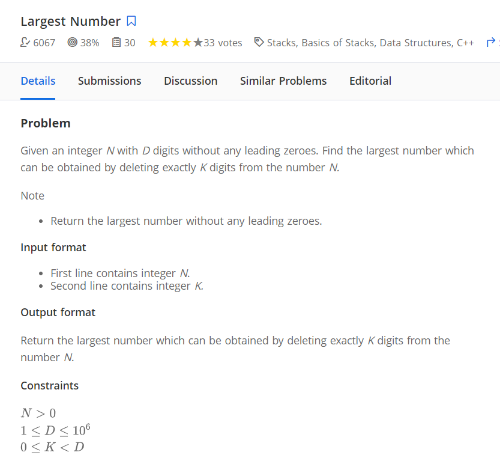

# STACK

### Questions (Easy + Medium)

1. Next greater element

```cpp
  vector<int> res(n, -1);
  stack<int> s;
  for (int i = 0; i < n; i++)
  {
    // > for nse
    while (!s.empty() && vec[s.top()] < vec[i])
    {
      res[s.top()] = vec[i];
      s.pop();
    }

    s.push(i);
  }
```

**Note**
Use the above code. There is also a code which traverses from backward `don't get confused.` :)

2. [Largest Number](https://www.hackerearth.com/practice/data-structures/stacks/basics-of-stacks/practice-problems/algorithm/largest-number-7-eee0b7c3/)
   

```cpp
#include <bits/stdc++.h>
using namespace std;
int main()
{
  string s;
  cin >> s;
  int k;
  cin >> k;

  stack<int> stk;

  for (auto &ch : s)
  {
    while (!stk.empty() && k > 0 && stk.top() < ch)
    {
      stk.pop();
      k--;
    }
    stk.push(ch);
  }

  string res;
  while (!stk.empty())
  {
    res.push_back(stk.top());
    stk.pop();
  }

  cout << res << endl;

  reverse(res.begin(), res.end());
  while (k--)
    res.pop_back();
  cout << res << endl;

  return 0;
}
```

<p><b>Approach : </b>Using a montonic decreasing stack.</p><br/>
